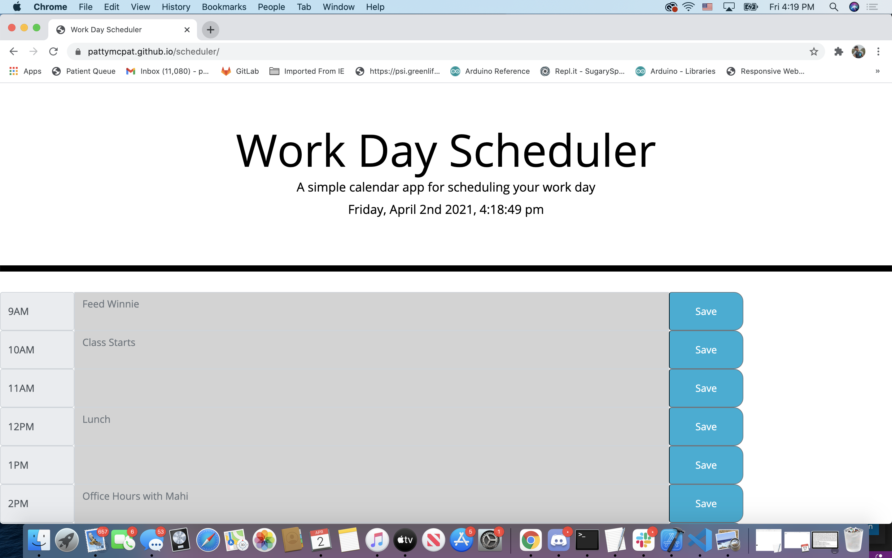
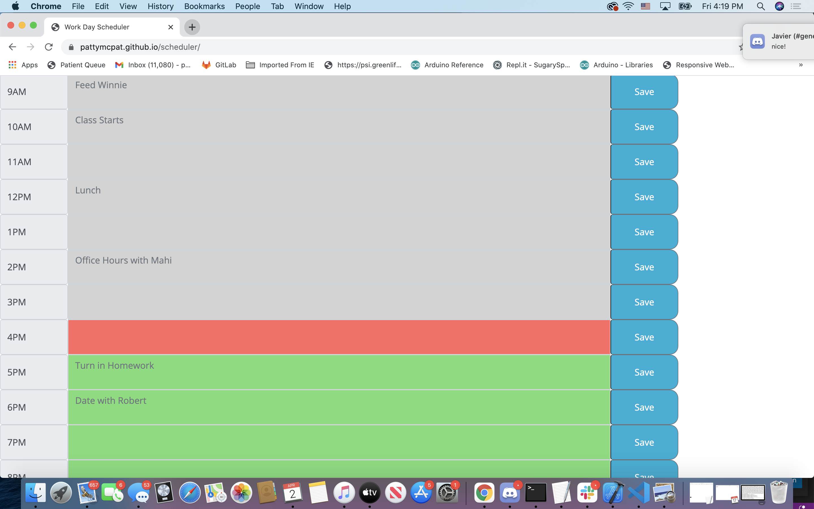

# Work Day Scheduler
## User Story

**AS AN** employee with a busy schedule<br>
**I WANT** to add important events to a daily planner<br>
**SO THAT** I can manage my time effectively<br>
<hr>

## Acceptance Criteria
**GIVEN** I am using a daily planner to create a schedule<br>
**WHEN** I open the planner<br>
**THEN** the current day is displayed at the top of the calendar<br><br>
**WHEN** I scroll down<br>
**THEN** I am presented with timeblocks for standard business hours<br><br>
**WHEN** I view the timeblocks for that day<br>
**THEN** each timeblock is color coded to indicate whether it is in the past, present, or future<br><br>
**WHEN** I click into a timeblock<br>
**THEN** I can enter an event<br><br>
**WHEN** I click the save button for that timeblock<br>
**THEN** the text for that event is saved in local storage<br><br>
**WHEN** I refresh the page<br>
**THEN** the saved events persist<br><br>
<hr>

## Description

This is what I did to finish the project. 
1. Updated index.html file to add in DOM ids to each element, link to the Bootstrap API and jQuery API. Created individual rows for each hour with a lable, textarea and and save button
2. in the JS file. I first used moment.js to show current day and time as well as created a varible for current hour used moment.js to set that variable to the current hour of the day. 
3. Then I created variables for each hour of the day I wanted to display
4. Then I created varibles to point to each text area DOM element in the HTML
5. Then I created variables for each hour to retrieve the localstorage values for each entry
6. Then I created variables for each hour to retrieve the value inputed into each text box. 
7. Created an array with variables for each hour input
8. Created a function to change the background of the text areas to represent past present and future
```
function changeBGcolor() {
for (var i = 0; i<hours.length; i++){
    if (hours[i]==currentHour){
        hoursInput[i].setAttribute("class", "form-control col-8 present");
    }

    else if (hours[i]>=currentHour){
        hoursInput[i].setAttribute("class", "form-control col-8 future");
    }
else if (hours[i]<=currentHour){
    hoursInput[i].setAttribute("class", "form-control col-8 past");
}

    }
```

9. Created a function for each hour, for when the save button is clicked, function will retrieve the value of the text input box and then save the item to localstorage and then used setAttribute method to change the placeholder of the text box to what the use inputed for that hour. 
```
   function store9AM(){
    var input9AM = document.getElementById("9").value;
    localStorage.setItem("9", input9AM);
    nineAMInput.setAttribute("placeholder",stored9AM);
   }
```

10. Created a conditional for each time slot so that null doesnt show if localstorage values are not currently set.
```
if (stored9AM!=null){
    nineAMInput.setAttribute("placeholder",stored9AM);} 
```

11. Called the changeBGcolor() function to run globally. 
<hr>

## Technology Used
1. HTML
2. CSS
3. Bootstrap Framework
4. Javascript
5. JQuery
<hr>

## Screenshot


